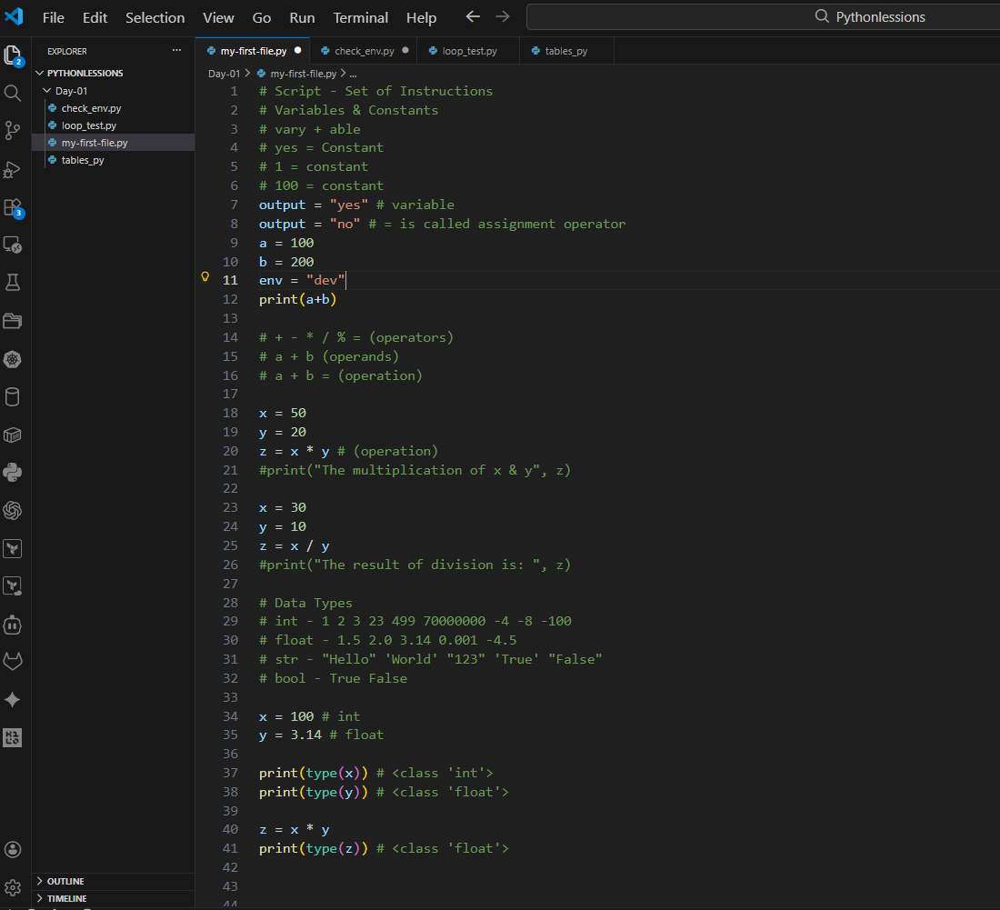

Day 16 - Shell Scripting

## Task
Start your shell scripting journey — learn the fundamentals every script needs.

You will:
- Understand **shebang** (`#!/bin/bash`) and why it matters
- Work with **variables**, **echo**, and **read**
- Write basic **if-else** conditions

### Task 1: Your First Script
1. Create a file `hello.sh`
2. Add the shebang line `#!/bin/bash` at the top
3. Print `Hello, DevOps!` using `echo`
4. Make it executable and run it

**Document:** What happens if you remove the shebang line?

#!/bin/bash is shebang if i remove it will use default shell #!/bin/sh

With shebang → The OS uses the specified interpreter (e.g., /bin/bash).

Without shebang → The OS uses the current shell (the one you’re in) to interpret the file.

If your current shell is bash, it will run as bash.
If your current shell is zsh, dash, etc., it will run in that shell — which may cause errors if your script uses syntax not supported by that shell.

---

### Task 2: Variables
1. Create `variables.sh` with:
   - A variable for your `NAME`
   - A variable for your `ROLE` (e.g., "DevOps Engineer")
   - Print: `Hello, I am <NAME> and I am a <ROLE>`

2. Try using single quotes vs double quotes — what's the difference?

Single quotes ('):
Everything inside is taken literally — no variable expansion or escape sequences.

name="John"
echo 'Hello $name'   # Output: Hello $name

Double quotes ("):
Allows variable expansion and escape sequences.

name="John"
echo "Hello $name"   # Output: Hello John

---

### Task 3: User Input with read
1. Create `greet.sh` that:
   - Asks the user for their name using `read`
   - Asks for their favourite tool
   - Prints: `Hello <name>, your favourite tool is <tool>`

---

### Task 4: If-Else Conditions
1. Create `check_number.sh` that:
   - Takes a number using `read`
   - Prints whether it is **positive**, **negative**, or **zero**

Here is check_number.sh

2. Create `file_check.sh` that:
   - Asks for a filename
   - Checks if the file **exists** using `-f`
   - Prints appropriate message

Here is file_check.sh

---

### Task 5: Combine It All
Create `server_check.sh` that:
1. Stores a service name in a variable (e.g., `nginx`, `sshd`)
2. Asks the user: "Do you want to check the status? (y/n)"
3. If `y` — runs `systemctl status <service>` and prints whether it's **active** or **not**
4. If `n` — prints "Skipped."

Here is server_check.sh

---

What I learned

1. Shebang: `#!/bin/bash` tells the system which interpreter to use
2. Variables: `NAME="Shubham"` (no spaces around `=`)
3. Read: `read -p "Enter name: " NAME`
4. If syntax: `if [ condition ]; then ... elif ... else ... fi`
5. File check: `if [ -f filename ]; then`   
6. How to write and run shell scripts with shebangs, variables, and user input using read.
7. The difference between single vs double quotes, and how quoting affects variable expansion.
8. Using conditional logic (if, elif, else) and test operators (-f, -gt, -lt) to handle files and numbers.
9. Error redirection (>/dev/null, 2>/dev/null, &>/dev/null).