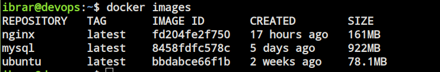
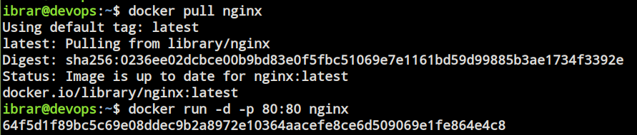
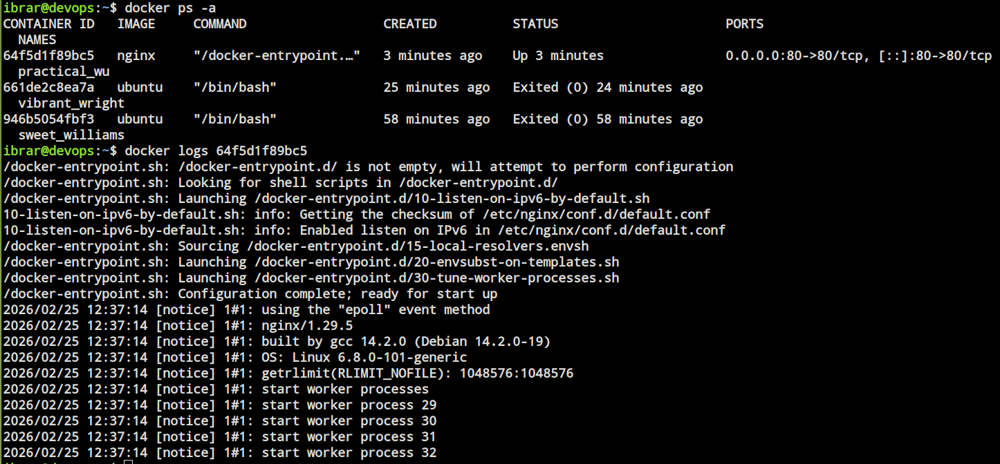
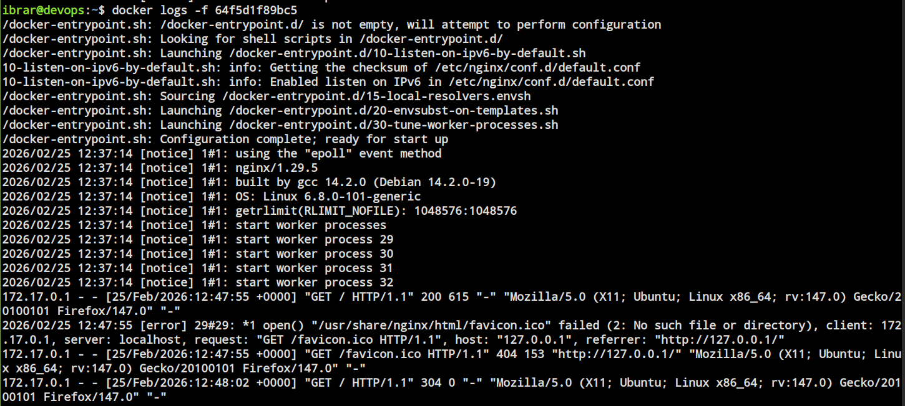
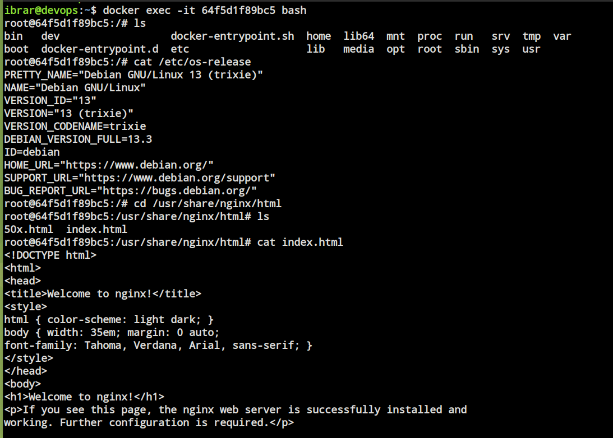
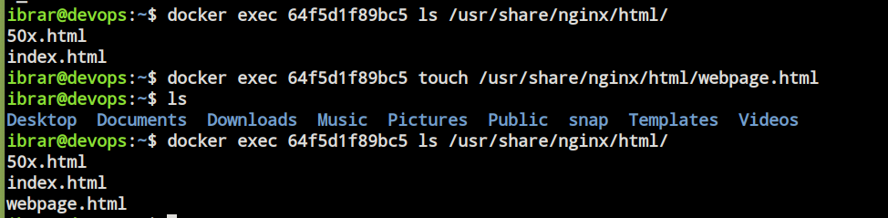
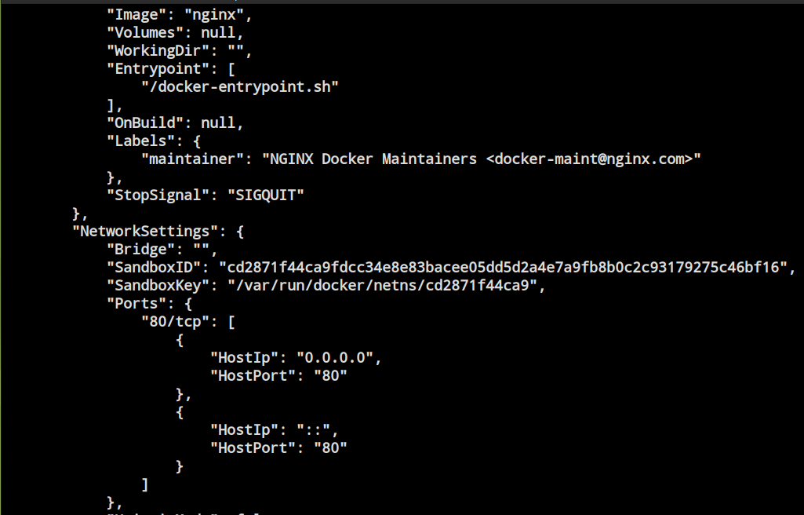
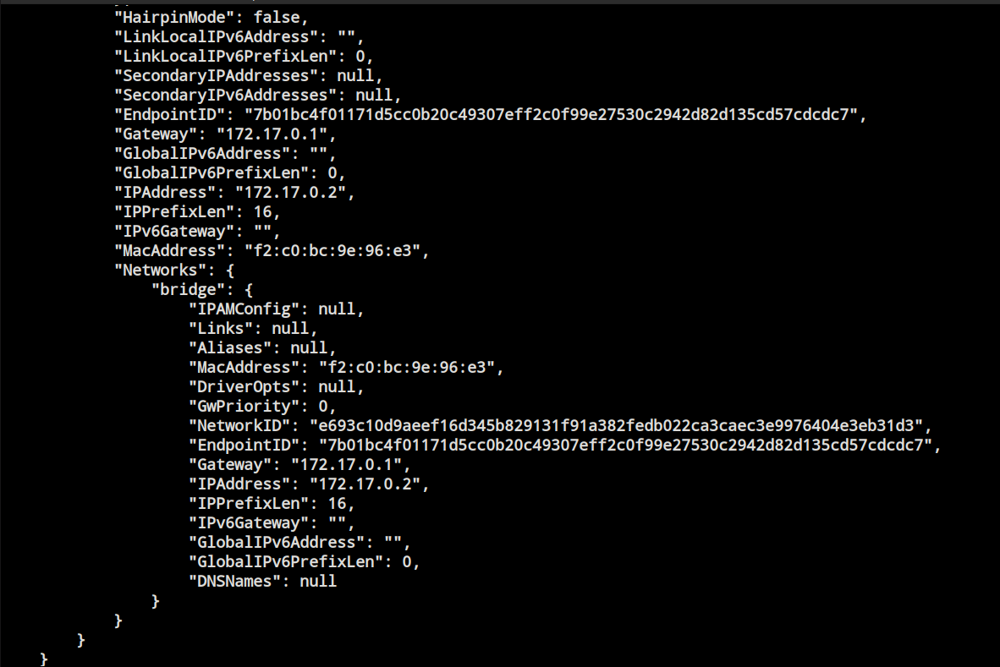
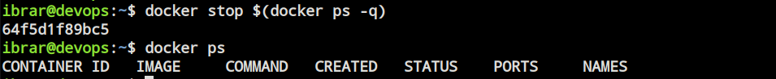
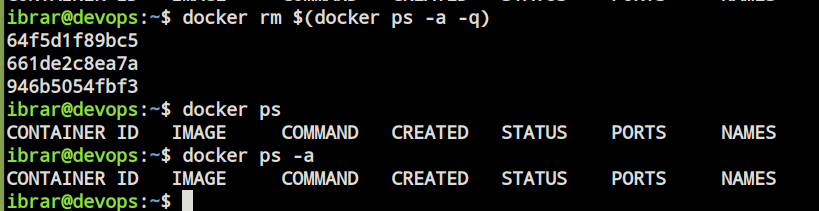

# Day 30 – Docker Images & Container Lifecycle

## Commands

# sudo apt install docker.io # Install Docker
# getent docker group # Check Docker group
# sudo usermod -aG docker $USER # Add user to Docker group
# newgrep docker # Check if user is in Docker group
# docker --version # Check Docker version
# docker ps # List running containers
# docker ps -a # List all containers
# docker pull <image> # Pull an image from Docker Hub
# docker images # List images
# docker run -it <image> # Run a container interactively
# docker run -d <image> # Run a container in detached mode
# docker exec -it containerid bash # Exec into a running container
# docker start containerid # Start a stopped container
# docker stop containerid # Stop a running container
# docker pause/ unpause containerid # Pause/unpause a running container
# docker restart containerid # Restart a running container
# docker kill containerid # Kill a running container
# docker rm containerid # Remove a container

## Task 1: Docker Images
1. Pull the `nginx`, `ubuntu`, and `mysql` images from Docker Hub
     * `docker pull <image>`
   
2. List all images on your machine — note the sizes

    
    
3. Compare `ubuntu` vs `alpine` — why is one much smaller?
     * `Ubuntu` - smaller image size, faster startup, and consumes fewer resources compared to heavier images.
               lighter: ubuntu is a full operating system image.
     * `mysql` -  Larger image size, slower startup, and consumes more resources compared to lighter images.
               heavier: mysql is a database server image with more dependencies and features.
  
4. Inspect an image — what information can you see?

  * Image ID
  * Image Tag
  * Created Time
  * Default Config
    * Ports
    * Environment variables
    * Entrypoint
    * CMD
  * Architecture
  * OS
  * Size
  * Graph Driver
  * Layers
  
5. Remove an image you no longer need
     * `docker rmi <image-id>`
     
---

## Task 2: Image Layers
1. Run `docker image history mysql` — what do you see?
2. Each line is a **layer**. Note how some layers show sizes and some show 0B
3. Write in your notes: What are layers and why does Docker use them?

       Docker image layers are created with every changes made to the file system.
       Every instruction in dockerfile creates a separate layer (FROM, COPY, RUN, CMD etc).
       Layers are very important as docker caches every layer while creating the image and stores it in docker engine.
       Now if you recreate after changing docker uses cached layers for unchanged layers. 
       Hence images are build faster and more efficient.
      
    
    
---

## Task 3: Container Lifecycle
Practice the full lifecycle on one container:
1. **Create** a container (without starting it)
2. **Start** the container
3. **Pause** it and check status
4. **Unpause** it
5. **Stop** it
6. **Restart** it
7. **Kill** it
8. **Remove** it

Check `docker ps -a` after each step — observe the state changes.

   
    
   
    
---

## Task 4: Working with Running Containers
1. Run an Nginx container in detached mode

    
    
2. View its **logs**

    
    
3. View **real-time logs** (follow mode)

    
    
4. **Exec** into the container and look around the filesystem

    
    
5. Run a single command inside the container without entering it

    
    
6. **Inspect** the container — find its IP address, port mappings, and mounts

# docker inspect containerid # Inspect a running container

    
    
---

### Task 5: Cleanup
1. Stop all running containers in one command

# docker stop $(docker ps -q) # Stop all running containers

    
    
2. Remove all stopped containers in one command

# docker rm $(docker ps -a -q) # Remove all stopped containers

    
    
* Using prune

# docker system prune -a # Remove all unused data (containers, images, volumes, networks)

    
    
3. Remove unused images

# docker rmi $(docker images) # Remove all images

    
    
4. Check how much disk space Docker is using

# docker system df # Check disk usage

    
    
    
---

