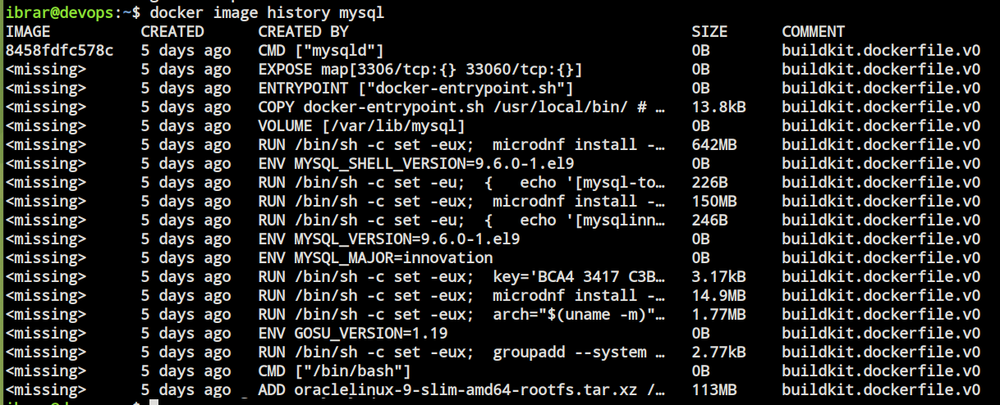
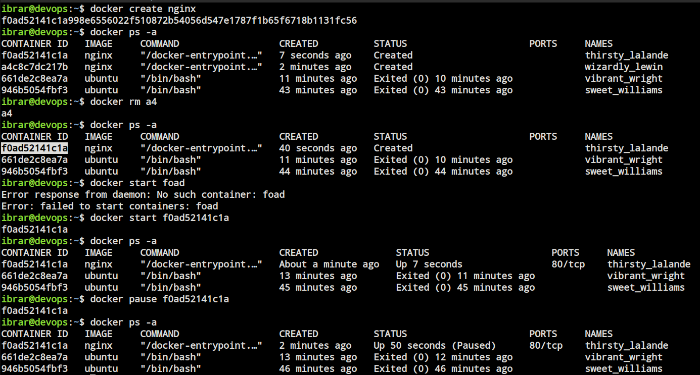
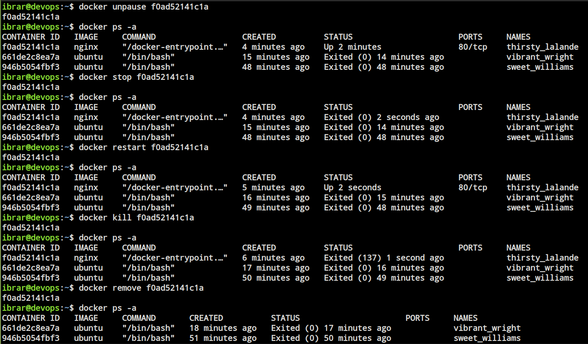
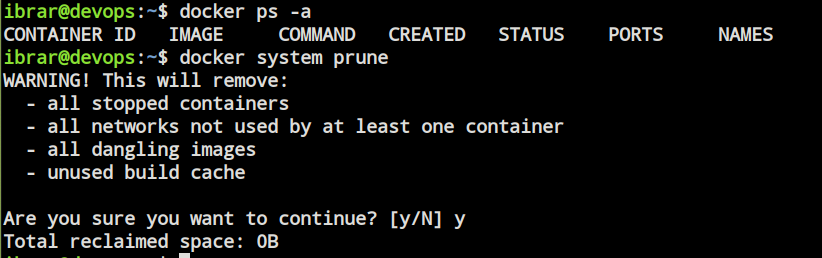
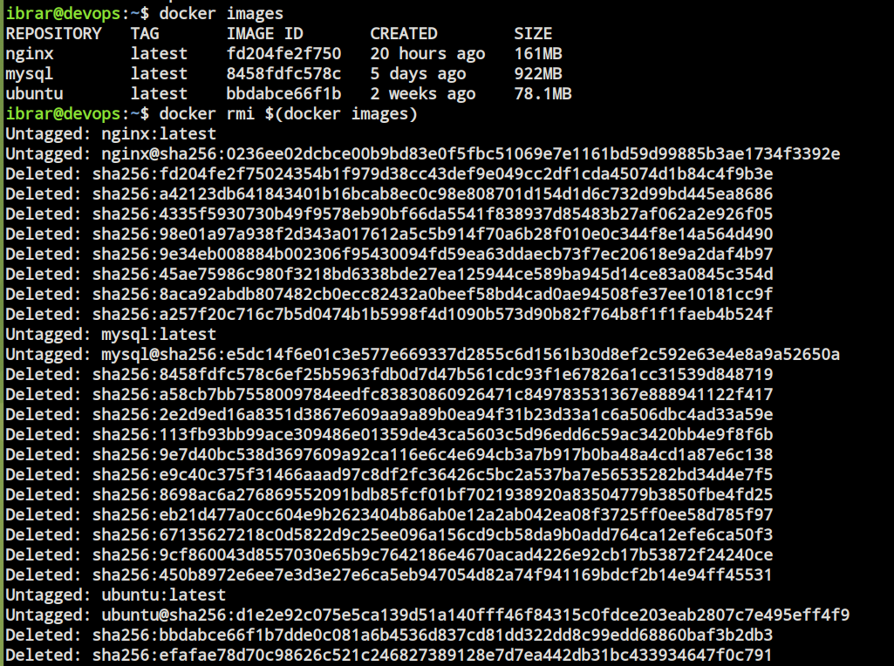
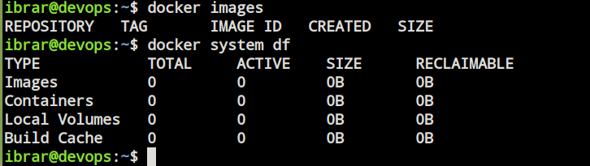

# Day 30 – Docker Images & Container Lifecycle

## Task 1: Docker Images
1. Pull the `nginx`, `ubuntu`, and `alpine` images from Docker Hub
     * `docker pull <image>`
   
2. List all images on your machine — note the sizes

    
    
3. Compare `ubuntu` vs `alpine` — why is one much smaller?
     * `Ubuntu` - Larger image size because it includes many built‑in tools, libraries, and GNU utilities.
               Heavier: slower startup and consumes more resources compared to Alpine.
     * `Alpine` - Smaller image size since it contains fewer tools and libraries by default, so you install only what you need.
               Lightweight: faster startup, minimal resource usage, ideal for microservices.
  
4. Inspect an image — what information can you see?

  * Image ID
  * Image Tag
  * Created Time
  * Default Config
    * Ports
    * Environment variables
    * Entrypoint
    * CMD
  * Architecture
  * OS
  * Size
  * Graph Driver
  * Layers
  
5. Remove an image you no longer need
     * `docker rmi <image-id>`
     
---

## Task 2: Image Layers
1. Run `docker image history nginx` — what do you see?
2. Each line is a **layer**. Note how some layers show sizes and some show 0B
3. Write in your notes: What are layers and why does Docker use them?

       Docker image layers are created with every changes made to the file system.
       Every instruction in dockerfile creates a separate layer (FROM, COPY, RUN, CMD etc).
       Layers are very important as docker caches every layer while creating the image and stores it in docker engine.
       Now if you recreate after changing docker uses cached layers for unchanged layers. 
       Hence images are build faster and more efficient.
      
    
    
---

## Task 3: Container Lifecycle
Practice the full lifecycle on one container:
1. **Create** a container (without starting it)
2. **Start** the container
3. **Pause** it and check status
4. **Unpause** it
5. **Stop** it
6. **Restart** it
7. **Kill** it
8. **Remove** it

Check `docker ps -a` after each step — observe the state changes.

   
    
   
    
---

## Task 4: Working with Running Containers
1. Run an Nginx container in detached mode

    
    
2. View its **logs**

    
    
3. View **real-time logs** (follow mode)

    
    
4. **Exec** into the container and look around the filesystem

    
    
5. Run a single command inside the container without entering it

    
    
6. **Inspect** the container — find its IP address, port mappings, and mounts

    
    
    

---

### Task 5: Cleanup
1. Stop all running containers in one command

    
    
2. Remove all stopped containers in one command

    
    
* Using prune
    
    
    
3. Remove unused images

    
    
4. Check how much disk space Docker is using

    
    
---

