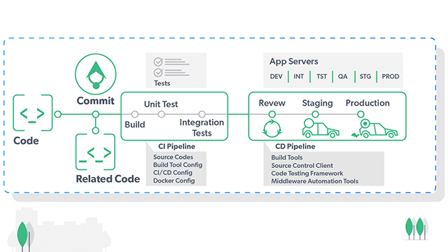

### Task 1: the Problem
''''''
Think about a team of 5 developers all pushing code to the same repo manually deploying to production.

1. What can go wrong?

Overwrites & conflicts: One developer's changes can overwrite another's if they all push at the same time.

No rollback strategy: Reverting to a previous state is often manual, slow, and risky.

Human error/Configuration mismatch: A deveoper might forget to change config file, use the wrong branch, merging errors. files missing

Production Downtime: Manual pushes raise bugs and errors cause service interruptions.

No Audit Trail: If the site breaks at 3:00 AM, it is nearly impossible to tell which of the 5 developers' manual changes caused the crash.

2. What does "it works on my machine" mean and why is it a real problem?

Definition: A developer's code works fine on his machine but fails in production or any other machine.
reasons:
It happes because of different OS's and versions gap, missing supporting dependencies, libraries, database, networks and ports.
It leads to communication gap and blame each other and no of unstable deployments

3. How many times a day can a team safely deploy manually?

1–2 times per day at most weekend or off-peak hours to minimize impact of potential issues.
Why limited:
Each manual deployment requires checks, downtime windows and human oversight.
More frequent deployment increases the chance of mistkes and production instability.
'''''
### Task 2: CI vs CD
''''''
Research and write short definitions (2-3 lines each):

Continuous Integration — what happens, how often, what it catches

When a developers pushes code to a version control system like(GitHub) the CI system automatiocally triggers the actions:
Pulls the latest code
Builds the application
Runs automated tests
Validates code quality
Generate artifacts if successful
How often:
Every time a code is pushed, multiple times a day.
What it catches:
syntax errors, compiling errors, logic errors, integration issues, environment drift.
Example: Instagram
Engineers commit code dozens of times per day. Every commit triggers automated builds and tests across thousands of servers.

Continuous Delivery — how it's different from CI, what "delivery" means

CI stops at code works and passes tests.
CD ensures the code packaged, versioned and ready to be deployed to production at any time.
Delivery gurantees production readiness at anytime, a human or automated trigger can deploy it with a single click or command.
Example: Amazon
Every service is packaged and tested. Artifacts are stored in registries. And deployment can be triggred at any time.

Continuous Deployment — how it differs from Delivery, when teams use it
CD automatically deploys every change that passes CI tests to production without human intervention.
Teams use it when they have high confidence in their automated tests and want to release features to users as quickly as possible.
Example: Netflix
Netflix deploys code thousands of times per day. Every change that passes tests is automatically released to users without manual approval.
''''''
### Task 3: Pipeline Anatomy
''''''
A pipeline has these parts — write what each one does:

Trigger — what starts the pipeline , on push, pull request, schedule, manual trigger
Stage — a logical phase (build, test, deploy), stages can run sequentially or in parallel
Job — a unit of work inside a stage, jobs can run on different machines (ubuntu-latest, mac-latest, windows-latest) or environments, each job runs independently can have its own steps. Brakes down the stage into smaller tasks.
Step — a single command or action inside a job, steps are executed in order, smallest unit of work, can be a shell command, script, or action
Runner — the machine that executes the job, can be hosted by the CI/CD provider or self-hosted, can be configured with specific OS where jobs run.
Artifact — output produced by a job, can be compiled code, test results, Docker images, or any files needed for later stages or deployment. Artifacts can be stored and shared between jobs and stages. share results between stages(build artifacts, test reports, deployment packages)
''''''
### Task 4: Draw a Pipeline
''''''
Draw a CI/CD pipeline for this scenario:

A developer pushes code to GitHub. The app is tested, built into a Docker image, and deployed to a staging server.

''''''
### Task 5: Explore in the Wild
''''''
1. Open any popular open-source repo on GitHub (Kubernetes, React, FastAPI — pick one you know)
2. Find their `.github/workflows/` folder
3. Open one workflow YAML file
4. Write in your notes:

https://github.com/kubernetes/minikube/blob/master/.github/workflows/build.yml

What triggers it?
The workflow is triggered on push to the main branch and on pull requests targeting the main branch.
How many jobs does it have?
The workflow has 3 jobs: build, test, and deploy.
What does it do?
- The build job compiles the code and creates a Docker image.
- The test job runs unit tests and integration tests against the built image.
- the build image starts with Docker Compose, runs tests, and then pushes the image to a registry if tests pass.
''''''
