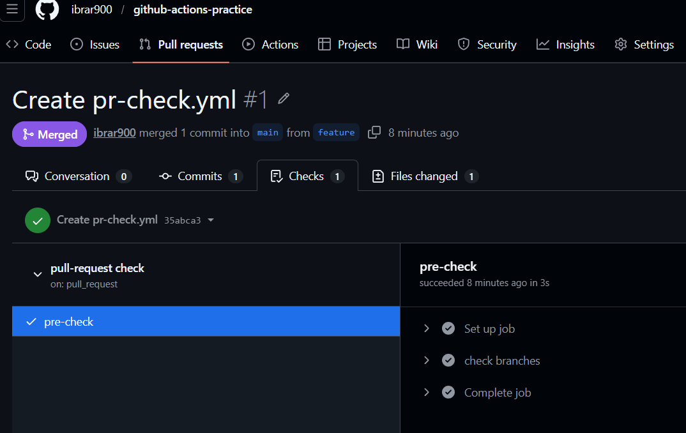
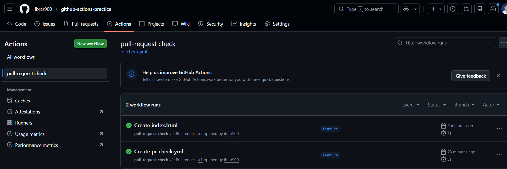

# Day 41 – Triggers & Matrix Builds

### Task 1: Trigger on Pull Request
1. Create `.github/workflows/pr-check.yml`
2. Trigger it only when a pull request is **opened or updated** against `main`
3. Add a step that prints: `PR check running for branch: <branch name>`
4. Create a new branch, push a commit, and open a PR
5. Watch the workflow run automatically

**Verify:** Does it show up on the PR page? - YES

  After creating pull request

  After updating pull request

### Task 2: Scheduled Trigger
1. Add a `schedule:` trigger to any workflow using cron syntax
2. Set it to run every day at midnight UTC
3. Write in your notes: What is the cron expression for every Monday at 9 AM?

 0 9 * * 1 # Minute, Hour, Day of month, Month, Day of week
 

### Task 3: Manual Trigger
1. Create `.github/workflows/manual.yml` with a `workflow_dispatch:` trigger
2. Add an **input** that asks for an `environment` name (staging/production)
3. Print the input value in a step
4. Go to the **Actions** tab → find the workflow → click **Run workflow**

**Verify:** Can you trigger it manually and see your input printed?

